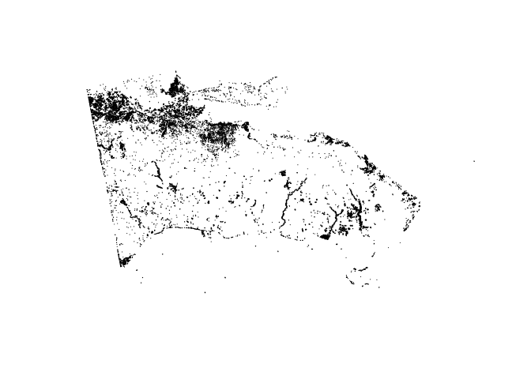

Flood map of Hurricane Fiona, East Dominican Republic, September 2022 /
Mapa de inundación y encharcamiento tras el paso del huracán Fiona, este
de República Dominicana, septiembre 2022
================

## How to cite? / ¿Cómo citar?

[](https://zenodo.org/badge/latestdoi/538619204)

-   APA:

José-Ramón Martínez-Batlle. (2022). geofis/floods-fiona-sep-2022: First
release (v.0.0.0.9000). Zenodo. <https://doi.org/10.5281/zenodo.7098255>

-   BibTex:

<!-- -->

    @software{jose_ramon_martinez_batlle_2022_7098255,
      author       = {José-Ramón Martínez-Batlle},
      title        = {geofis/floods-fiona-sep-2022: First release},
      month        = sep,
      year         = 2022,
      publisher    = {Zenodo},
      version      = {v.0.0.0.9000},
      doi          = {10.5281/zenodo.7098255},
      url          = {https://doi.org/10.5281/zenodo.7098255}
    }

## Generate virtual raster

From QGIS or GDAL, use the following sequence: pre-VH, pre-VV, post-VH,
post-VV.

Something like this might also work:

``` bash
gdalbuildvrt -overwrite -resolution highest -separate -r nearest -input_file_list INPUTFILELIST.txt /tmp/processing_PMyLBb/dc8a8f13d9484bc080415d063aba9d4c/OUTPUT.vrt
```

## Create training sites in QGIS using the multiband visualization layer (flooded-blue)

\#\#Run the classification algorithm

``` r
library(rgdal)
library(gdalUtils)
library(raster)
library(caret)
library(randomForest)
```

``` r
#PREPARANDO DATOS PARA CLASIFICACION
# img <- brick('geom_corrected/stack.vrt')
img <- brick('geom_corrected/stack_despeckled.vrt')
names(img) <- c('pre_vh','pre_vv','post_vh','post_vv')
img
#TRSITES
trdata <- readOGR('trsites/trsites_32619.shp', stringsAsFactors=T)
columnaresp <- 'tipo'
#TABLA ENTRENAMIENTO
dftodo <- data.frame(matrix(vector(), nrow = 0, ncol = length(names(img)) + 1))
categorias <- NULL; i <- NULL; mapacategorias <- NULL; datos <- NULL; df <- NULL
for (i in 1:length(unique(trdata[[columnaresp]])))
{
  categorias <- unique(trdata[[columnaresp]])[i]
  mapacategorias <- trdata[trdata[[columnaresp]] == categorias,]
  datos <- extract(img,mapacategorias)
  datos <- lapply(datos, function(x){cbind(x, clase = as.numeric(rep(categorias, nrow(x))))})
  df <- do.call("rbind", datos)
  dftodo <- rbind(dftodo, df)
}
dftodo$clase <- as.factor(dftodo$clase)
str(dftodo)
#head(dftodo)
muestras <- 10000
sdftodo <- subset(dftodo[sample(1:nrow(dftodo), muestras), ])
#head(sdftodo)
#str(sdftodo)
#sdftodo <- sdftodo[,c(2:4,7)]
modelorf <- train(clase ~ pre_vh + pre_vv + post_vh + post_vv, method = "rf", sdftodo)
modelorf
saveRDS(modelorf, 'modelorf.RDS')
#PREDICCION SOBRE IMAGEN Y SUAVIZADO CON FILTRO MODAL VENTANA 3X3
lclasifrf <- raster::predict(img, modelorf)
writeRaster(lclasifrf, 'classified/lclasifrf.tif', drivername = 'GTiff', overwrite = TRUE)
mf <- matrix(rep(1, 9), nrow=3)
mf
lclasifrffm <- focal(lclasifrf, mf, modal)
writeRaster(lclasifrffm, 'classified/lclasifrffm.tif', drivername='GTiff', overwrite = TRUE)
```

## Post-processing

-   Created a GRASS region
-   Imported the raster `lclasifrf.tif` into it
-   Converted the raster to vector (file: `classified.gpkg`)

``` r
flooded <- readOGR('classified/clasificado_para_lm.gpkg')
```

    ## OGR data source with driver: GPKG 
    ## Source: "/media/jose/datos/radar/processed/floods-fiona-sep-2022/classified/clasificado_para_lm.gpkg", layer: "clasificado_para_lm"
    ## with 8672 features
    ## It has 2 fields
    ## Integer64 fields read as strings:  cat

``` r
plot(flooded)
```

<!-- -->

EN: Hurricane Fiona: flooded areas, East and Northeast Dominican
Republic, as of 19 de September, 2022, 7 pm local time ES: Huracán
Fiona: zonas inundadas y encharcadas, Este y Nordeste de República
Dominicana, al 19 de septiembte de 2022, 7 pm hora local

 
